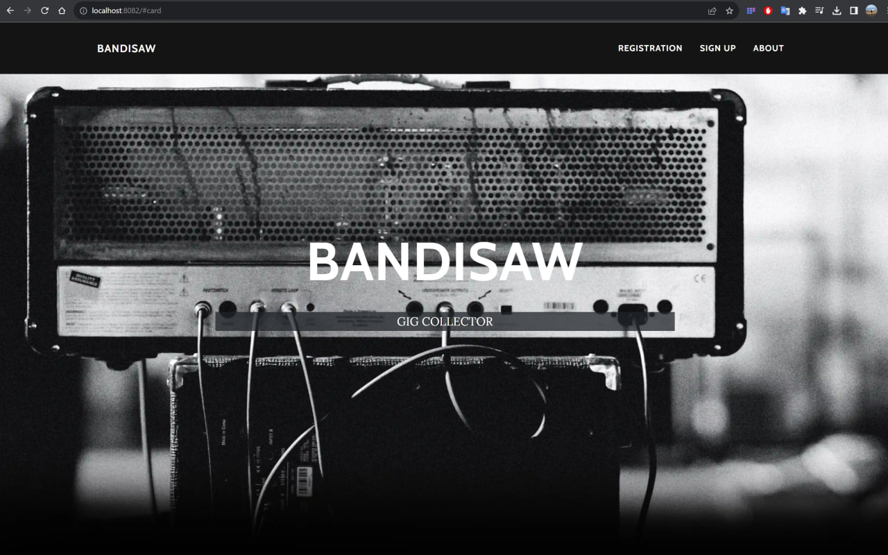
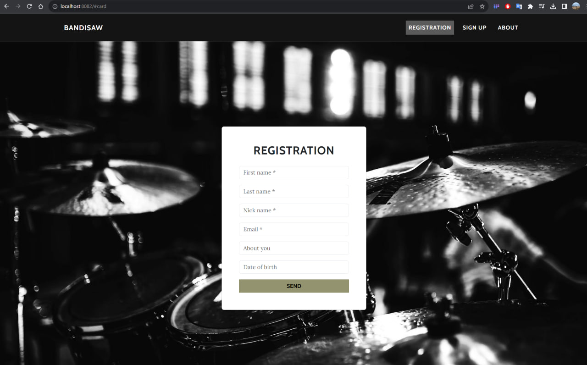
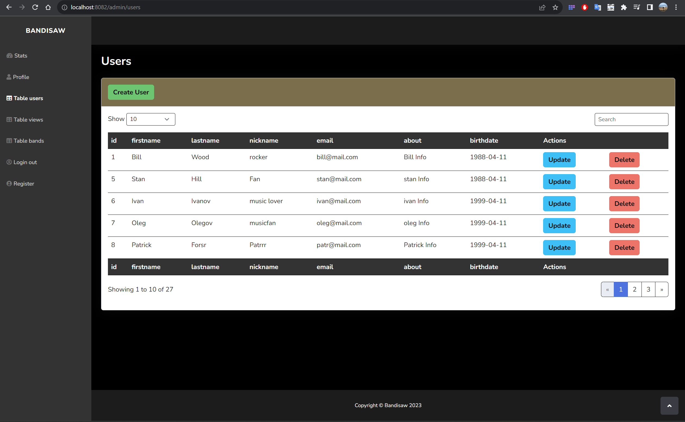
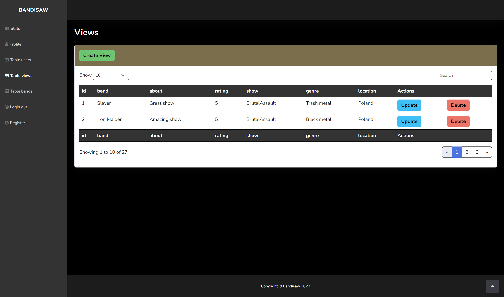
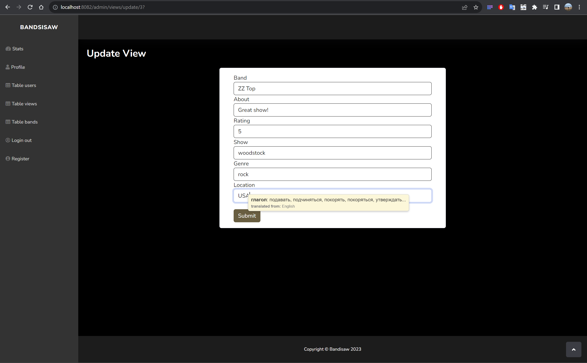

# java-bandisaw(In progress)

A multi-module application that allows you to save visited music concerts in your profile and receive achievements for this. The application will have an account for the administrator and users.

Stack:
- Java 17 (Core, Collections, Optional, Stream)
- Spring Boot
- Hibernate
- PostgreSQL
- Maven
- Lombok
- Postman
- Bootstrap
- Thymeleaf

## Application structure

Main API
The main service in which the main functions of applications are implemented
- /users
- /views
- /bands
- ...

Front API
Contains html templates and a reactive WebClient for interacting the main service.
Screens: 

Main page:

Registration form:

Admin's forms:

